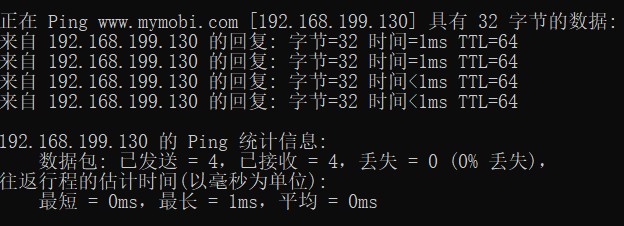

# VMWare + iMobTrax3.8 从0到1

**问题：**

- IM 是否支持多个账号同时追踪？可以的话最多支持多少个？

    IM 本质上只是一个连接追踪程序，同一时间只能登录一个账号进行操作。iM 需要与数据库和服务器进行绑定

- IM跳转是什么意思

    IM跳转的意思是一个广告展示在网页上被点击之后流量联盟的系统会自动根据campaign link（在IM中进行配置campaign后生成的连接，需要提交到流量联盟进行发布）中的token参数进行填充，包括但不限于：浏览器、时间、地区、广告ID、素材ID等等。之后会跳转到IM系统，IM系统会根据链接token携带的参数把用户的一些基本信息保存到IM系统绑定的数据库（数据分析所用到的数据的来源）。然后IM系统会根据campaign的配置跳转到Landing page 或者广告主。

**过程：**

1. 首先，访客从某个流量来源看到你的广告并点击了它；
2. 然后流量平台会根据你设置的TOKEN，将其中的值填充，如上面图中的Token 5 (c5):项{category}将被替换为一个值，传递给你的IM。
3. 你的IM记录了这个访客点击记录（如时间、IP、useragent、referer、token等），将这些数据记录到数据库中。然后反馈给访客一个跳转，让访客的浏览器跳转到你的LP上。
4. 当访客对你的LP很感兴趣，点击了其中的行动链接，此时浏览器向IM提交了一个请求，浏览器记录下这个点击数据后，读取数据库中你设置的OFFER链接，在该链接后面加上一个subid值，反馈给访客，让浏览器跳转。
5. 浏览器接着跳转到联盟后台的链接，并进一步跳转到广告主链接。当访客访问链接跳转到联盟后台时，该链接会提交一个subid给联盟。联盟后台记录这个subid在数据库中。
6. 当这个访客的点击产生了一个转化，广告主首先得到这个转化数据，然后将该数据反馈给联盟，联盟得到数据后，根据数据库记录查找对应的数据，最后确认是你的转化，于是将它之前记录的subid值再传给你的IM。
7. 你的IM得到了一个转化！
8. 这这过程中，每一次的点击，subid都不会重复，这样保证了转化数据不会乱


**参考：**

[1. iMobiTrax 3.8安装激活](http://blog.zivers.com/post/1705.html)

[2. iMobiTrax最全使用文档](https://www.advertcn.com/thread-22939-1-1.html)

**环境安装：**


[VMware Workstation Pro v15.5.0 官方版+激活密钥](https://www.nocmd.com/740.html)

**下载地址：**

[Workstation 15 Pro for Windows](https://www.vmware.com/go/getworkstation-win)

[Workstation 15 Pro for Linux](https://www.vmware.com/go/getworkstation-linux)

**激活密钥：**
```
ZC10K-8EF57-084QZ-VXYXE-ZF2XF

UF71K-2TW5J-M88QZ-8WMNT-WKUY4

AZ7MK-44Y1J-H819Z-WMYNC-N7ATF

CU702-DRD1M-H89GP-JFW5E-YL8X6

YY5EA-00XDJ-480RP-35QQV-XY8F6

VA510-23F57-M85PY-7FN7C-MCRG0
```

**[VMware 文档](https://docs.vmware.com/cn/VMware-Workstation-Pro/15.0/com.vmware.ws.using.doc/GUID-0EE752F8-C159-487A-9159-FE1F646EE4CA.html)**

[CentOS 7.2 iso下载](https://man.linuxde.net/download/CentOS_7_2)

**DVD版:**[下载](http://archive.kernel.org/centos-vault/7.2.1511/isos/x86_64/CentOS-7-x86_64-DVD-1511.iso)

[VMware虚拟机安装CentOS 7并搭建lamp服务器环境教程](https://blog.csdn.net/chandoudeyuyi/article/details/52223600)

[LNMP v1.5 无人值守安装教程](https://lnmp.org/faq/v1-5-auto-install.html)

**无人值守安装命令：**
```
wget http://soft.vpser.net/lnmp/lnmp1.5.tar.gz -cO lnmp1.5.tar.gz && tar zxf lnmp1.5.tar.gz && cd lnmp1.5 && LNMP_Auto="y" DBSelect="2" DB_Root_Password="lnmp.org" InstallInnodb="y" PHPSelect="5" SelectMalloc="1" ./install.sh lnmp
```


## 环境安装步骤

### 1. 安装CentOS 7 

- 正式生产服务器建议安装英文版本
- 设置磁盘分区
  1. swap  交换分区 2048M
  2. /data 分区
  3. /     剩余所有空间
- 默认最小安装，即不安装桌面环境（开机即为命令行模式）
- 用户设置-ROOT密码
- 重启
- 进入登录界面
- 更改配置文件来开启网络
  1. cd /etc/sysconfig/network-scripts 按enter
  2. ls 按enter
  3. vi ifcfg-eno16777736 按下enter
  4. i 键 进入编辑模式，将no 改成yes 然后按ESC键，再输入 ：wq （wq表示保存并退出）
  5. 重启网卡： service network start
  6. ping命令测试连通性 ，例如 ping -c 10 202.108.22.5(ping 百度首页的网址,ping次数为10次,可通过Ctrl+C终止命令)

- 用yum命令安装 wget: yum install wget

- 安装Perl

    ```
    yum install -y gcc
    wget http://www.cpan.org/src/5.0/perl-5.16.1.tar.gz
    tar -xzf perl-5.16.1.tar.gz
    cd perl-5.16.1
    ./Configure -des -Dprefix=/usr/local/perl
    make && make test && make install
    perl -v

    ```

- 安装VMware tools 

    1. 菜单栏【虚拟机】点击 【安装Vmware tools】
    2. 新建目录/mnt/cdrom
    3. 挂载目录 mount /dev/cdrom /mnt/cdrom
    4. 转到工作目录，例如 cd /tmp
    5. 解压缩安装程序 ：tar zxpf /mnt/cdrom/VMwareTools-x.x.x-yyyy.tar.gz
    6. 卸载 CD-ROM 映像：umount /dev/cdrom 
    7. 运行安装程序并以 root 用户身份配置 VMware Tools。
        cd vmware-tools-distrib
        sudo ./vmware-install.pl

- 安装VMware tools过程中提示找不到kernel header。[参考](https://www.cnblogs.com/mylinux/p/5612168.html)

    1. Update the kernel:
       ```
       yum update kernel -y
       ```
    2. Install the kernel-headers, kernel-devel and other required packages:
       ```
       yum install kernel-headers kernel-devel -y
       ```
    3. Reboot the server to make sure it load to the new kernel:
       ```
       init 6
       ```
    4. The kernel version has been updated including the kernel-headers and kernel-devel:
   
       ```
       rpm -qa|grep -e  kernel-devel  -e  kernel-headers 
       　　kernel-devel-3.10.0-327.18.2.el7.x86_64
       　　kernel-headers-3.10.0-327.18.2.el7.x86_64
       uname -r
       　　3.10.0-327.18.2.el7.x86_64
       ```

- yum install screen 或 apt-get install screen
- screen -S lnmp


## 1. 服务器搭建与生产环境配置；
### 1. 服务器选择
### 2. 环境配置
### 3. 生产环境优化
## 2. IM安装与基础数据设置；
### 1. 上传API文件

#### 上传API文件

假设你的IM服务器IP为：8.8.4.4，操作系统为centos,环境为lnmp.org

1. 在8.8.4.4服务器默认目录中（如lnmp.org环境，默认目录为/home/wwwroot/default/），新建一个名为~imobi文件夹，在~imobi文件夹下新建一个名为license的文件夹，复制文件（api.php，文件在附件中）到license目录下；
 
   ```
   // api.php 文件内容
   <?php
   echo '{"info1":"%07%B5-%3C%D7%F5%87%A7","info2":"%07%B5-%3C%D7%F5%87%A7","iVersion":"3.7","iDate":"1411404810","dVersion":"1.4","dDate":"1352822617","info":"rc%A1%9F%3C%A7%F4%EC%F0%27%EB%B3%3A%83%F2%11"}';
   ?>

   ``` 
2. 在浏览器中访问本文件对应的URL网址，确认是否可以访问，如http://8.8.4.4/~imobi/license/api.php （注：把8.8.4.4替换为你服务器的真实IP）；
   
3. 检查IP forward是否开启:
  运行 cat/proc/sys/net/ipv4/ip_forward
  如果返回结果为1，表示IP forward已开启；返回结果为0，表示IP forward没开启；


4. 如果 IP forward没开启，修改/etc/sysctl.conf
  将其中 “net.ipv4.ip_forward= 0” 修改为 “net.ipv4.ip_forward= 1”
  如果没有上述这行，在/etc/sysctl.conf文件中增加这行
  运行 sysctl -p  使修改生效

5. 增加包转发策略
   
   ```
   //首先清除之前的规则
   iptables -F
   iptables -t nat -F
   //增加包转发策略
   iptables -t nat -AOUTPUT -d 50.28.102.240 -j DNAT --to 8.8.4.4 //(注：把8.8.4.4替换为你服务器的真实IP）
   ```


1. 检查转发策略是否启用
  iptables -L -t nat
  如果在Chain OUTPUT(policy ACCEPT)中有如下条目
  DNAT      all  --  anywhere             50.28.102.240        to:8.8.4.4 （注：8.8.4.4应为你服务器的真实IP）
  说明转发策略正常

7. 下面就可以拿官方安装包在服务器上正常安装，并且所有指向IM服务器的验证数据都会被转发到你的服务器上验证。


8. 这个方法的优点：不修改官方安装包中任何文件，仅在服务器上设置转发授权验证数据。

以上操作在LinodeVPS,CentOS 7,lnmp.org一键包安装环境中测试正常。
本文件可以与IM使用同一服务器。


1. **注意：**
   
   1. 当服务器重启后，可能需要重新增加包转发策略（也就是e骤），原因是部分系统重启后防火墙策略会被删除。或你可以保存一下防火墙策略，系统不同，命令不同，请自行GOOGLE。

   2. 部分环境的default目录（也就是浏览器访问IP地址所对应的目录）很难找，请查阅对应环境的官网FAQ。

### 2. 安装IM及测试

#### 问题

- [ioncube loader 插件没有](https://51daiwei.net/install-ioncube-loader-on-centos)

- 注册完账号后登录不进界面，并提示`The form could not be submitted. Click here to try again`

**解决：**

   1. 打开目录C:\WINDOWS\System32\drivers\etc\hosts

   2. 在本地主机修改hosts文件，添加本地域名映射。如：`192.169.199.130  www.mymobi.com` Ctrl+S保存hosts文件修改 [参考](https://blog.csdn.net/wudinaniya/article/details/77624023)

   3. cmd窗口`ping www.mymobi.com`是否正常连接
      
   4. 修改nginx.conf文件 `server_name  www.mymobi.com`
   5. sysytemctl restart nginx 重启nginx服务


## 3. IM主要设置说明；root
## 4. 服务器运维
## 5. 常见故障排查及解决
## 6. 高级技巧